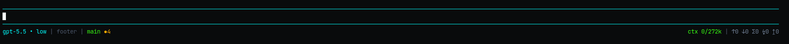

# pi-clean-footer

Clean adaptive footer extension for [pi](https://pi.dev).

Shows a compact split footer:



## Features

- Smart short model names, plus thinking effort (`low`, `med`, `high`, `xhigh`)
- Current directory basename only
- Git branch + dirty file count, including untracked files
- Event-driven git refresh after file-changing tools and user bash commands
- Context usage as `used/max`
- Cumulative active-branch token totals: input, output, total, cache read, cache write
- Adaptive width tiers for narrow terminals
- `/footer` toggle
- `/footer refresh` force refresh

## Install

From local checkout:

```bash
pi install /absolute/path/to/pi-clean-footer
```

For project-local install, run from your project:

```bash
pi install -l /absolute/path/to/pi-clean-footer
```

For quick testing without installing:

```bash
pi -e /absolute/path/to/pi-clean-footer
```

Then reload pi resources:

```text
/reload
```

## Usage

Toggle footer:

```text
/footer
```

Force git refresh:

```text
/footer refresh
```

Show active config paths and resolved config:

```text
/footer config
```

Reload config after editing JSON:

```text
/footer reload
```

## Configuration

Config is optional. Defaults match the built-in package behavior.

Load order:

1. Global: `~/.pi/agent/clean-footer.json`
2. Project: `.pi/clean-footer.json`

Project config overrides global config. Nested `modelAliases` and `colors` are merged.

Example:

```json
{
  "enabled": true,
  "showGit": true,
  "showTokens": true,
  "showCache": false,
  "showContext": true,
  "showDirectory": true,
  "showEffort": true,
  "gitRefreshDebounceMs": 500,
  "contextWarningPercent": 70,
  "contextDangerPercent": 85,
  "modelAliases": {
    "claude-sonnet-4-5-20250929": "sonnet-4.5",
    "gpt-5.5-codex": "gpt-5.5"
  },
  "colors": {
    "model": "accent",
    "directory": "dim",
    "git": "success",
    "gitDirty": "warning",
    "contextNormal": "success",
    "contextWarning": "warning",
    "contextDanger": "error",
    "tokens": "muted",
    "separator": "dim"
  }
}
```

Malformed JSON keeps defaults/last loaded behavior and reports an error through `/footer config` or at startup.

## Package manifest

This package declares its extension through `package.json`:

```json
{
  "pi": {
    "extensions": ["./src/index.ts"]
  }
}
```

## Development

Type-check extension:

```bash
npx tsc --noEmit --skipLibCheck --moduleResolution Node16 --module Node16 --target ES2022 --types node src/index.ts
```

## Notes

Extensions run with full system permissions. Review code before installing any pi package.
