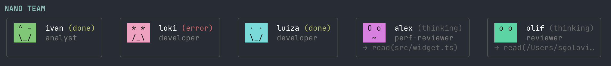
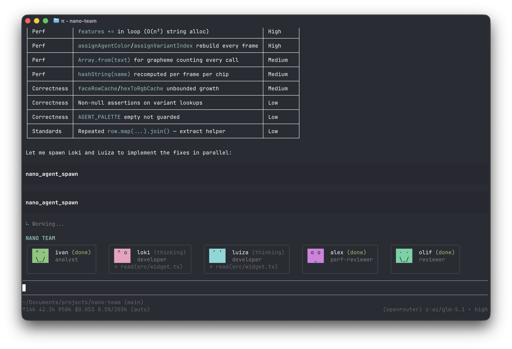

<div align="center">

# NANO AGENTS

**A tiny `pi.dev` extension that runs your subagents and shows them as a compact chip row above the editor.**



</div>

## What it is

You define a roster of subagents in YAML. The main pi agent can then spawn them, kill them, or check on them with five small tools. They run as isolated `pi` subprocesses, in parallel if you want, and a widget pinned above the editor animates each one's face while it thinks, works, finishes, or blows up.

That's the whole thing. No queues, no scheduling, no orchestration DSL.

## In action

Two agents spawned in one turn, working in parallel:

<p align="center">
  
</p>

## Tools

Five of them, that's it:

- `nano_agent_spawn(name, task?, timeoutMs?)` — run a team member. Returns the agent's final output plus an `instanceId`. `task` overrides the YAML default.
- `nano_agent_kill(name, instanceId?)` — abort a live run. `instanceId` is required when `name` has multiple concurrent live runs.
- `nano_agent_status(name?, instanceId?)` — markdown table of every team member, or one agent's full transcript.
- `nano_agent_aggregate(tasks, aggregator, timeoutMs?)` — run N agents in parallel, then run `aggregator` (a team-member name) whose `task` may reference `{previous}` for the joined upstream outputs.
- `nano_agent_chain(steps, timeoutMs?)` — run agents sequentially; each step's output is substituted for `{previous}` in the next.

Issue several `spawn`/`aggregate`/`chain` calls in one turn and they go off in parallel. Agents marked `readOnly: true` may run multiple concurrent instances; pass `instance` labels in aggregate tasks to target a specific run later.

## Adding an agent

Drop a YAML file at `.pi/nano-team/team/<name>.yaml`:

```yaml
name: developer
role: developer
model: inception/mercury-2
instructions: |
  You write TypeScript that meets this project's standards.
  - strict mode; no `any`; functional style; immutable data
  - no comments unless the WHY is non-obvious
task: |
  Implement the requested change end-to-end. State the file paths touched in the summary.
```

The fields:

- `name` — what you'll call them in `nano_agent_spawn` (required)
- `role` — one lowercased word (developer, reviewer, analyst…) (required)
- `instructions` — system prompt for the subagent (required)
- `task` — default task; can be overridden per spawn (required)
- `model` — any model id pi knows about (optional; omit to inherit pi's default)
- `description` — short blurb shown on a second line under this agent in the system prompt's roster (optional)
- `readOnly` — `true` lets multiple instances of this agent run concurrently; useful for read-only scouts several callers can dispatch in parallel (optional, defaults to `false`)

A `.md` file with the same YAML frontmatter also works — drop it into the same `.pi/nano-team/team/` directory.

Run `/reload` after editing. A few starter agents live in `examples/team/` if you want to copy from.

## Trust model

Every agent in your team is equally trusted. `nano_agent_aggregate` and `nano_agent_chain` pass prior outputs verbatim into the next agent's prompt — the aggregator sees the raw text of every upstream step substituted into `{previous}`. There is no sandboxing, no escaping, no output filtering.

This is by design: the agents are subprocesses you've explicitly chosen to run, and your own YAML defines their system prompts. If you wouldn't trust an agent with the rest of your work, don't add it to your team. The same caveat applies to every multi-agent system (Claude Code subagents, LangGraph, CrewAI, etc.) that passes outputs between agents — the trust boundary is your own team definition.

## Install

From npm:

```
pi install npm:@neilurk12/pi-nano-agents
```

Or from GitHub:

```
pi install git:github.com/neilurk12/pi-nano-agents
```

That writes to your global pi settings (`~/.pi/agent/settings.json`). Pass `-l` to install only for the current project. Other install sources work too — local path, https URL — see the [pi packages docs](https://github.com/badlogic/pi-mono/blob/main/packages/coding-agent/docs/packages.md) for the full list.

Verify with `pi list`. Remove with `pi remove @neilurk12/pi-nano-agents`. Run `/subagents-doctor` inside any session to inspect the loaded team, parse errors, and active runs.

## The faces

Each agent gets its own color, picked from a 12-color palette so they don't blur into each other on the row. Five states (`idle`, `thinking`, `working`, `done`, `error`), four variants per state, animating frame by frame. Errors get crossed-out eyes and a frown. It's not load-bearing — it's just nicer to look at than a status bar.

## Stack

- TypeScript strict, no build step. The extension loads as `.ts` source via jiti.
- Deps: `@mariozechner/pi-coding-agent`, `yaml`, `typebox`. Nothing else.

## License

MIT — see [LICENSE](LICENSE).
